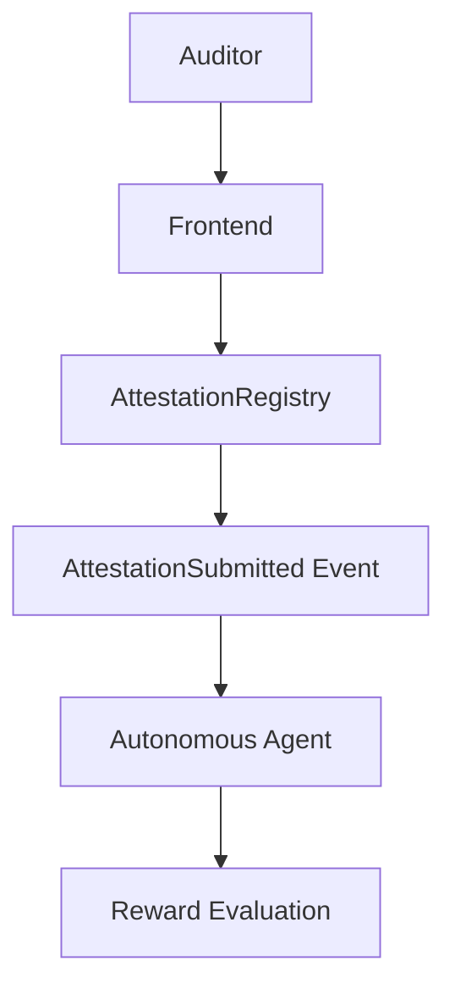

# Provenance Streams

Provenance Streams is an autonomous USDC settlement engine built on Arc.

The long-term vision: AI agents monitor on-chain attestations, evaluate reward
policies, and autonomously execute USDC payouts using a Developer Controlled
Wallet and Arc App Kit.

**This milestone is a functional vertical slice, not the full system.** It
proves the core loop — an auditor submits an attestation, the chain emits an
event, and an autonomous agent observes it and evaluates a reward rule — with
no payout, treasury, or cross-chain logic yet.

## Architecture



| Component       | Path                                                                     | Responsibility                                                                                |
| --------------- | ------------------------------------------------------------------------ | --------------------------------------------------------------------------------------------- |
| Smart contract  | [`contracts/AttestationRegistry.sol`](contracts/AttestationRegistry.sol) | Records attestations, rejects duplicate proof hashes, emits `AttestationSubmitted`.           |
| Shared protocol | [`packages/protocol`](packages/protocol)                                 | Contract ABI, decoded event/struct types, and chain config shared by the agent and frontend.  |
| Agent           | [`agent`](agent)                                                         | Watches the chain for `AttestationSubmitted`, logs each event, and evaluates the reward rule. |
| Backend         | [`apps/backend`](apps/backend)                                           | Thin process entrypoint that loads `.env` and runs the agent.                                 |
| Frontend        | [`apps/frontend`](apps/frontend)                                         | React form for submitting an attestation from a connected wallet.                             |

See [`docs/architecture.md`](docs/architecture.md) for a closer look at each
module's internals, and [`docs/decisions.md`](docs/decisions.md) for the
reasoning behind key choices and how they set up later milestones.

## Current progress (Milestone 1)

- [x] `AttestationRegistry.sol` — submit/get attestation, duplicate proof-hash
      prevention, `AttestationSubmitted` event. Hardhat 3 + viem project with a
      full `node:test` suite and an Ignition deployment module.
- [x] `packages/protocol` — shared ABI, types, and chain config.
- [x] Backend agent — `watcher.ts` / `rewardEngine.ts` / `logger.ts`, composed
      in `index.ts`, with unit tests for the reward rule.
- [x] `apps/backend` — runs the agent as a local process against a deployed
      contract.
- [x] `apps/frontend` — form to submit an attestation (Supplier Address,
      Policy ID, Proof Hash) from a browser wallet, showing the resulting
      transaction hash and confirmation.
- [x] End-to-end verified locally: submitting an attestation through the
      frontend (or directly on-chain) causes the backend to log the decoded
      event and, for a positive policy ID, `Reward Eligible`.

No payout, treasury, or cross-chain logic is implemented yet — that's by
design for this checkpoint.

## Next milestones

Future milestones will build on this foundation instead of replacing it:

- **Developer Controlled Wallet** — replace the frontend's injected-wallet
  flow with a Circle Developer Controlled Wallet for the auditor/supplier
  side, and give the agent its own wallet to execute payouts.
- **Arc App Kit** — integrate Arc's wallet/session tooling in the frontend.
- **Paymaster** — sponsor gas for attestation submission and payouts.
- **Circle CCTP** — cross-chain USDC settlement once payout logic exists.
- **Payout logic** — extend `rewardEngine.ts`'s decision output into an
  actual USDC transfer, backed by a treasury contract.

## Repository structure

```
provenance-streams/
├── apps/
│   ├── frontend/       # React + Vite form
│   └── backend/        # Agent process entrypoint
├── packages/
│   └── protocol/       # Shared ABI, types, chain config
├── agent/              # watcher / rewardEngine / logger
├── contracts/          # AttestationRegistry.sol
├── ignition/           # Deployment module
├── scripts/            # `hardhat run` scripts
├── test/               # Contract tests
├── docs/               # Architecture & decision notes
└── README.md
```

## Local setup

### Prerequisites

- Node.js `>= 22.12.0` and npm `>= 10`
- A browser wallet extension (e.g. [MetaMask](https://metamask.io)) to submit
  attestations from the frontend

### 1. Install dependencies

```bash
npm install
```

### 2. Configure environment variables

```bash
cp .env.example .env
```

The defaults already match a local Hardhat node (`http://127.0.0.1:8545`,
chain id `31337`). You'll update `CONTRACT_ADDRESS` /
`VITE_CONTRACT_ADDRESS` after deploying in step 4.

### 3. Start a local chain

```bash
npm run contract:node
```

Leave this running — it's your local Hardhat network. It prints a list of
funded test accounts and private keys; import one into your wallet extension
and point the wallet at a custom network with RPC URL
`http://127.0.0.1:8545` and chain id `31337`.

### 4. Deploy the contract

In a new terminal:

```bash
npm run contract:deploy
```

This prints the deployed address. Copy it into both `CONTRACT_ADDRESS` and
`VITE_CONTRACT_ADDRESS` in `.env`.

### 5. Start the backend agent

```bash
npm run dev -w @provenance-streams/backend
```

It connects to the chain and starts watching for `AttestationSubmitted`
events.

### 6. Start the frontend

```bash
npm run dev -w @provenance-streams/frontend
```

Open the printed URL (typically `http://localhost:5173`), connect your
wallet, and fill in the form:

- **Supplier Address** — any address (e.g. a second test account)
- **Policy ID** — a positive integer to be reward-eligible, e.g. `1`
- **Proof Hash** — free-text evidence reference; it's hashed with keccak256
  client-side before being sent on-chain

Submit, approve the transaction in your wallet, and you should see the
transaction hash and a success confirmation in the UI — and, in the terminal
running the backend agent, the decoded event followed by `Reward Eligible`.

## Development scripts

Run from the repo root:

| Command                    | Description                                          |
| -------------------------- | ---------------------------------------------------- |
| `npm run contract:compile` | Compile contracts                                    |
| `npm run contract:node`    | Start a local Hardhat chain                          |
| `npm run contract:deploy`  | Deploy `AttestationRegistry` to `localhost`          |
| `npm test`                 | Run contract tests and all workspace test suites     |
| `npm run lint`             | Lint the whole monorepo                              |
| `npm run format`           | Format the whole monorepo                            |
| `npm run typecheck`        | Typecheck contracts scripts/tests and all workspaces |
| `npm run check`            | Format check + lint + typecheck + tests              |

## License

MIT — see [LICENSE](LICENSE).
