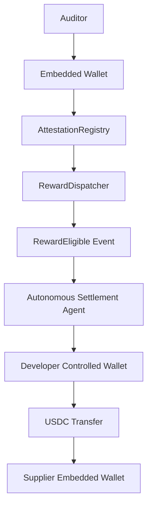
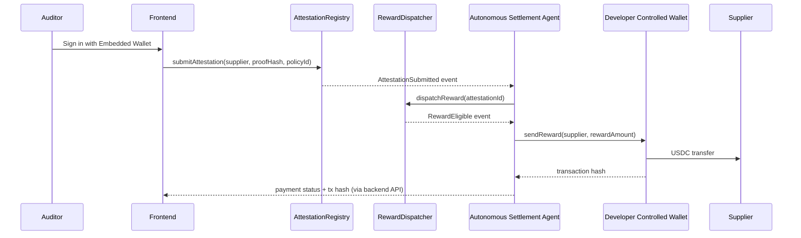

# Provenance Streams

Provenance Streams is an autonomous USDC settlement engine built on Arc.

The long-term vision: AI agents monitor on-chain attestations, evaluate reward
policies, and autonomously execute USDC payouts using a Developer Controlled
Wallet, Arc App Kit, and Circle CCTP for cross-chain settlement.

**Milestone 1** proved the core loop — an auditor submits an attestation, the
chain emits an event, and an agent observes it and evaluates a reward rule.

**Milestone 2** (this one) makes that loop autonomous and real: embedded
wallets replace placeholder wallet handling, a Developer Controlled Wallet
treasury sends real test USDC on Arc, on-chain reward policies decide
eligibility, and an Autonomous Settlement Agent processes the full pipeline
end to end. Cross-chain settlement (Circle CCTP) is reserved for Milestone 3.

## Architecture



### Sequence



This milestone keeps settlement on Arc. **Milestone 3** adds Circle CCTP,
Arc App Kit, a Paymaster, and more advanced treasury policies on top of this
architecture, without requiring the pipeline above to be rebuilt.

### Components

| Component                   | Path                                                                     | Responsibility                                                                                                                     |
| --------------------------- | ------------------------------------------------------------------------ | ---------------------------------------------------------------------------------------------------------------------------------- |
| Attestation registry        | [`contracts/AttestationRegistry.sol`](contracts/AttestationRegistry.sol) | Records attestations, rejects duplicate proof hashes, emits `AttestationSubmitted`.                                                |
| Reward policy               | [`contracts/RewardPolicy.sol`](contracts/RewardPolicy.sol)               | Owner-configurable reward policies (credential type, reward amount, enabled).                                                      |
| Reward dispatcher           | [`contracts/RewardDispatcher.sol`](contracts/RewardDispatcher.sol)       | Validates eligibility against a policy, prevents duplicate rewards, emits `RewardEligible`. Holds no funds.                        |
| Shared protocol             | [`packages/protocol`](packages/protocol)                                 | Contract ABIs, decoded event/struct types, and chain config (local Hardhat + Arc testnet) shared everywhere.                       |
| Autonomous Settlement Agent | [`agent`](agent)                                                         | Watches `AttestationSubmitted` → dispatches rewards on-chain → watches `RewardEligible` → executes USDC payments via the treasury. |
| Backend API                 | [`apps/backend`](apps/backend)                                           | Runs the agent, exposes dashboard read APIs, and brokers Circle embedded-wallet sessions for the frontend.                         |
| Frontend                    | [`apps/frontend`](apps/frontend)                                         | Auditor, Supplier, and Admin dashboards; embedded-wallet login; attestation submission.                                            |

See [`docs/architecture.md`](docs/architecture.md) for a closer look at each
module's internals, and [`docs/decisions.md`](docs/decisions.md) for the
reasoning behind key choices and how they set up Milestone 3.

## Wallet architecture

Two distinct wallet models are in play, matching Circle's product split:

- **Embedded (User-Controlled) Wallets** — used by the **Auditor** and
  **Supplier** dashboards. The frontend never touches a Circle API key: it
  calls `apps/backend`'s `/api/wallet-sessions/*` routes, which broker a
  `userToken` + `encryptionKey` from Circle, and the browser's
  `@circle-fin/w3s-pw-web-sdk` handles the rest (PIN entry, wallet creation,
  transaction approval) without any key material reaching this server. A
  user's wallet is keyed by their email, so it persists across sessions.
- **Developer Controlled Wallet (treasury)** — held entirely server-side by
  the agent's `TreasuryService`, funded to pay suppliers. Never exposed to
  the frontend.

Both are implemented against a common interface so a later swap (e.g. Arc App
Kit) touches one file, not the call sites. See
[`docs/decisions.md`](docs/decisions.md) for the specifics.

## Treasury architecture

`agent/src/treasuryService.ts` defines a `TreasuryService` interface
(`getBalance`, `sendReward`) with two implementations, selected by which
environment variables are set:

- **`CircleTreasuryService`** — real Circle Developer Controlled Wallet via
  `@circle-fin/developer-controlled-wallets`. Since Arc's native gas token
  _is_ USDC, sending USDC is a native-currency transfer, not an ERC-20 call.
  Used when `CIRCLE_API_KEY` / `CIRCLE_ENTITY_SECRET` / `CIRCLE_TREASURY_WALLET_ID`
  are set.
- **`LocalTreasuryService`** — a local viem-signed account that sends the
  configured chain's native currency directly. This is the local demo
  treasury (see [Local setup](#local-setup)) — structurally the same
  operation as the Circle path, just signed locally instead of by Circle's
  infrastructure. Used otherwise, via `TREASURY_PRIVATE_KEY`.

The agent's own operator wallet (`OPERATOR_PRIVATE_KEY`) is separate from
both: it only pays gas to call `RewardDispatcher.dispatchReward`, and never
holds treasury funds.

## Current progress (Milestone 2)

- [x] `RewardPolicy.sol` — `createPolicy` / `updatePolicy` / `disablePolicy` /
      `getPolicy`, owner-controlled (OpenZeppelin `Ownable`), policies
      configurable without redeploying.
- [x] `RewardDispatcher.sol` — validates eligibility against a policy,
      prevents duplicate rewards per attestation, emits `RewardEligible`.
      Holds no funds.
- [x] Autonomous Settlement Agent — `dispatcher.ts` (on-chain dispatch +
      `RewardEligible` watcher) and `treasuryService.ts` (Circle DCW / local
      signer), composed with the Milestone 1 `watcher.ts` / `rewardEngine.ts`
      in `index.ts`.
- [x] `apps/backend` is now an HTTP API: dashboard read endpoints
      (`/api/treasury`, `/api/policies`, `/api/attestations`, `/api/payments`)
      and embedded-wallet session/challenge brokering
      (`/api/wallet-sessions/*`).
- [x] Embedded wallet login (email-based, Circle User-Controlled Wallets) for
      the Auditor and Supplier dashboards; all their blockchain interactions
      (attestation submission included) go through the embedded wallet.
- [x] Auditor Dashboard — sign in, submit an attestation, view your
      submissions.
- [x] Supplier Dashboard — sign in, wallet address, USDC balance, reward
      history with payment status.
- [x] Admin Dashboard — treasury balance, create/view reward policies (via an
      owner-connected browser wallet), recent attestations, recent payments.
- [x] End-to-end verified locally in the demo (local embedded-wallet + local
      treasury) configuration: submitting an attestation triggers
      `dispatchReward`, which emits `RewardEligible`, which the agent
      settles — and the resulting transaction hash shows up in the Supplier
      and Admin dashboards.

Not implemented (by design, per Milestone 2's scope): Circle CCTP,
cross-chain payouts, advanced fraud scoring, and a Paymaster.

## Next milestone

Milestone 3 will extend this architecture with:

- **Circle CCTP** — cross-chain USDC settlement.
- **Arc App Kit** — richer wallet/session tooling in the frontend.
- **Paymaster** — sponsor gas for attestation submission and payouts.
- **Advanced treasury policies** — daily spending limits, allowed-contract
  lists, multi-approver controls.

## Repository structure

```
provenance-streams/
├── apps/
│   ├── frontend/       # React + Vite: Auditor / Supplier / Admin dashboards
│   └── backend/        # Express API: agent runner, dashboards, wallet sessions
├── packages/
│   └── protocol/       # Shared ABIs, types, chain config
├── agent/              # watcher / dispatcher / treasuryService / rewardEngine / logger
├── contracts/          # AttestationRegistry, RewardPolicy, RewardDispatcher
├── ignition/           # Deployment module
├── scripts/            # `hardhat run` scripts
├── test/               # Contract tests
├── docs/               # Architecture & decision notes
└── README.md
```

## Local setup

This runs the full pipeline locally without needing a real Circle account:
the treasury is a local signer, and the embedded wallet uses Circle's actual
User-Controlled Wallets infrastructure — you'll just need free Circle
sandbox credentials for that one piece (or you can leave it unconfigured and
the frontend will tell you embedded wallets are disabled).

### Prerequisites

- Node.js `>= 22.12.0` and npm `>= 10`
- A [Circle Developer Console](https://console.circle.com) account for
  embedded wallets (App ID + API key) — free, sandbox-only. Optional: without
  it, everything else in this milestone still runs, minus wallet login.
- A browser wallet extension (e.g. [MetaMask](https://metamask.io)) for the
  Admin Dashboard's policy management

### 1. Install dependencies

```bash
npm install
```

### 2. Configure environment variables

```bash
cp .env.example .env
```

The defaults already target a local Hardhat node and use Hardhat's
well-known local test accounts as the agent's operator wallet and local demo
treasury — never reuse these keys outside a local demo. You'll fill in the
contract addresses after deploying in step 4.

To enable embedded wallets, add your Circle sandbox `CIRCLE_API_KEY` and
`CIRCLE_APP_ID` (and set the matching `VITE_CIRCLE_APP_ID`). Leave
`CIRCLE_ENTITY_SECRET` / `CIRCLE_TREASURY_WALLET_ID` unset to keep using the
local demo treasury.

### 3. Start a local chain

```bash
npm run contract:node
```

Leave this running.

### 4. Deploy the contracts

In a new terminal:

```bash
npm run contract:deploy
```

This deploys `AttestationRegistry`, `RewardPolicy`, and `RewardDispatcher`,
and prints the values to copy into `.env` (`CONTRACT_ADDRESS`,
`REWARD_POLICY_ADDRESS`, `REWARD_DISPATCHER_ADDRESS`, and their `VITE_`
counterparts).

### 5. Start the backend

```bash
npm run dev -w @provenance-streams/backend
```

This starts the Autonomous Settlement Agent and the HTTP API
(`http://localhost:4000` by default).

### 6. Start the frontend

```bash
npm run dev -w @provenance-streams/frontend
```

Open the printed URL and try the flow:

1. **Admin** (`/admin`) — connect a browser wallet (any funded Hardhat test
   account) and create a reward policy, e.g. credential type
   `ISO-9001-AUDIT`, reward amount `1.5`.
2. **Auditor** (`/auditor`) — sign in with an email (creates an embedded
   wallet on first login), submit an attestation with any supplier address
   and the policy id you just created.
3. Watch the backend terminal: it logs the attestation, dispatches the
   reward on-chain, observes `RewardEligible`, and sends the payment.
4. **Supplier** (`/supplier`) — sign in with an embedded wallet using the
   supplier address's associated email (or check the Admin Dashboard's
   recent payments), see the balance update and the payment's transaction
   hash.

### Deployment guide (Arc testnet)

To run against real Arc instead of the local demo:

1. Set `RPC_URL=https://rpc.testnet.arc.io`, `CHAIN_ID=5042002`,
   `VITE_RPC_URL`/`VITE_CHAIN_ID` to match.
2. Fund an operator account from the [Arc testnet faucet](https://faucet.circle.com)
   and set `OPERATOR_PRIVATE_KEY`.
3. In the [Circle Developer Console](https://console.circle.com), create a
   Developer-Controlled wallet set and a wallet on `ARC-TESTNET`, fund it via
   the faucet, and set `CIRCLE_API_KEY`, `CIRCLE_ENTITY_SECRET`,
   `CIRCLE_TREASURY_WALLET_ID` (leave `CIRCLE_TREASURY_BLOCKCHAIN=ARC-TESTNET`).
4. Set `CIRCLE_APP_ID` / `VITE_CIRCLE_APP_ID` for embedded wallets.
5. Deploy contracts with `npm run contract:deploy -- --network arcTestnet`
   after adding an `arcTestnet` network to `hardhat.config.ts`.

## Development scripts

Run from the repo root:

| Command                    | Description                                          |
| -------------------------- | ---------------------------------------------------- |
| `npm run contract:compile` | Compile contracts                                    |
| `npm run contract:node`    | Start a local Hardhat chain                          |
| `npm run contract:deploy`  | Deploy the protocol contracts to `localhost`         |
| `npm run build`            | Build contracts and all workspaces                   |
| `npm test`                 | Run contract tests and all workspace test suites     |
| `npm run lint`             | Lint the whole monorepo                              |
| `npm run format`           | Format the whole monorepo                            |
| `npm run typecheck`        | Typecheck contracts scripts/tests and all workspaces |
| `npm run check`            | Format check + lint + typecheck + tests              |

## License

MIT — see [LICENSE](LICENSE).
