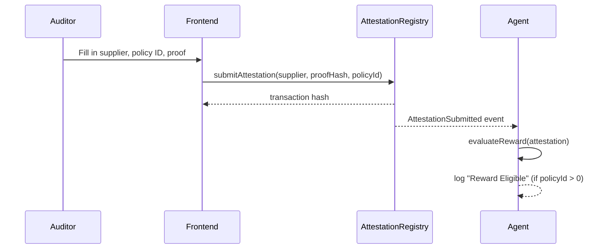

# Architecture

## Data flow

## Modules

### `contracts/AttestationRegistry.sol`

Stores attestations in a mapping keyed by a sequential `id`, and a second
mapping to reject duplicate `proofHash` values in O(1). The caller of
`submitAttestation` is recorded as the `auditor`; `supplier` is passed in
explicitly. No payout or treasury logic — this contract only ever appends
records and emits events.

### `packages/protocol`

The only place the contract's ABI and shape are defined outside Solidity.
Both `agent` and `apps/frontend` depend on it so a contract change (e.g. a
new event field) is a one-file update, not a hunt across two apps. It also
exports a reusable viem `Chain` definition (`hardhatLocal`) — a natural slot
to add an Arc chain definition in a later milestone.

### `agent`

Three single-responsibility modules composed in `index.ts`:

- `watcher.ts` — pure I/O: opens a viem `watchContractEvent` subscription and
  forwards decoded logs. Knows nothing about reward rules or logging format.
- `rewardEngine.ts` — pure function, no I/O. `evaluateReward(attestation) ->
{ eligible, reason }`. Unit tested in isolation.
- `logger.ts` — pure I/O: scoped, leveled console output.
- `config.ts` — validates raw config (rpc URL, contract address, chain id)
  with zod at the boundary, so bad configuration fails fast with a clear
  message instead of a cryptic runtime error deep in viem.

This separation is what lets later milestones swap one piece (e.g. replace
`console.log` in `logger.ts` with a real observability sink, or extend
`rewardEngine.ts`'s decision into a payout instruction) without touching the
others.

### `apps/backend`

A process, not a library: loads `.env`, calls `runAgent(...)` from `agent`,
and handles process lifecycle (`SIGINT`/`SIGTERM`). All the actual logic
lives in `agent` so it stays reusable outside a long-running process (e.g.
from a serverless handler or a test).

### `apps/frontend`

Vite + React 19, styled-components for CSS-in-JS (no Tailwind, per spec).
`lib/clients.ts` isolates all wallet/provider logic — `connectWallet()`
requests access to the injected `window.ethereum` provider and returns a
viem `WalletClient`. Everything else (the form, the result display) is
wallet-agnostic. That isolation is deliberate: swapping the injected-wallet
flow for a Developer Controlled Wallet / Arc App Kit session later means
rewriting `connectWallet()`, not the UI around it.
