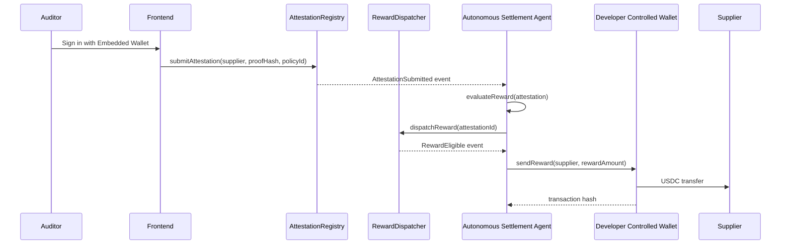

# Architecture

## Data flow

## Modules

### `contracts/AttestationRegistry.sol`

Unchanged since Milestone 1. Stores attestations in a mapping keyed by a
sequential `id`, and a second mapping to reject duplicate `proofHash` values
in O(1). The caller of `submitAttestation` is recorded as the `auditor`;
`supplier` is passed in explicitly. No payout or treasury logic — this
contract only ever appends records and emits events.

### `contracts/RewardPolicy.sol`

Owner-controlled (OpenZeppelin `Ownable`) CRUD over reward policies, keyed by
the same `policyId` an attestation references. Policies are never deleted —
`disablePolicy` just flips a flag — so historical rewards stay auditable
against the policy that was active when they were dispatched.

### `contracts/RewardDispatcher.sol`

Cross-references an attestation (read from `AttestationRegistry` via the
`IAttestationRegistry` interface) against its policy (read from
`RewardPolicy` via `IRewardPolicy`) and emits `RewardEligible` if the policy
is enabled. A `mapping(attestationId => bool)` prevents dispatching the same
attestation twice. Permissionless by design: eligibility is fully determined
by on-chain state, so there's no reason to restrict who can call it — in
practice, that's always the agent's operator wallet.

### `packages/protocol`

The only place the contracts' ABIs and shapes are defined outside Solidity.
`agent`, `apps/backend`, and `apps/frontend` all depend on it, so a contract
change is a one-file update, not a hunt across three apps. It also exports:

- `hardhatLocal` / `arcTestnet` — reusable viem `Chain` definitions, selected
  by `CHAIN_ID` rather than hardcoded per app.
- `encodeCredentialType` / `decodeCredentialType` — pack a short label (e.g.
  `"ISO-9001-AUDIT"`) into the `bytes32` `RewardPolicy.credentialType` field
  and back, so the Admin Dashboard can work with readable strings.
- `Payment` — the settlement record shape shared between the backend's
  `/api/payments` endpoint and the frontend's Supplier/Admin dashboards.

### `agent`

Five single-responsibility modules composed in `index.ts`:

- `watcher.ts` — pure I/O: opens a viem `watchContractEvent` subscription on
  `AttestationRegistry` and forwards decoded logs.
- `rewardEngine.ts` — pure function, no I/O. `evaluateReward(attestation) ->
{ eligible, reason }`, an off-chain pre-check before spending gas calling
  `dispatchReward` — the contract is still the authoritative check.
- `dispatcher.ts` — calls `RewardDispatcher.dispatchReward` on-chain (via
  `simulateContract` first, so `AlreadyDispatched` / `PolicyNotEnabled` are
  reported as typed results instead of thrown errors), and separately
  watches `RewardEligible`.
- `treasuryService.ts` — the `TreasuryService` interface plus its two
  implementations (Circle DCW, local signer). See
  [`decisions.md`](decisions.md) for why native-currency transfer is the
  right primitive here.
- `logger.ts` / `config.ts` — unchanged in spirit from Milestone 1: scoped
  leveled logging, and zod-validated configuration (now including the
  treasury's discriminated `circle | local` config) that fails fast with a
  clear message.

`index.ts`'s `runAgent()` wires these together and accepts optional hooks
(`onAttestation`, `onRewardEligible`, `onPaymentSettled`) so a host process
can track state (e.g. for HTTP dashboards) without the agent knowing
anything about persistence or transport — the same separation that let
Milestone 1's `logger.ts` be swapped without touching `watcher.ts`.

### `apps/backend`

Now a small Express API, not just a process wrapper:

- `main.ts` — loads `.env`, builds the `Store`, `TreasuryService`,
  `PolicyService`, and (if Circle credentials are set) `WalletService`,
  starts the agent, and starts the HTTP server.
- `store.ts` — in-memory read models for attestations and payments,
  populated by the agent's hooks. A deliberate demo-scale stand-in for a
  database: swapping it for one only touches this file.
- `services/policyService.ts` — reads `RewardPolicy` for the Admin
  Dashboard. Since the contract only exposes `getPolicy(id)` (per spec),
  this replays `PolicyCreated` events to discover known ids, then re-reads
  each one's current state.
- `services/walletService.ts` — brokers Circle User-Controlled Wallets: user
  sessions, wallet-creation challenges, and contract-execution challenges
  (for attestation submission), all requiring the API key this server holds
  and the frontend never sees.
- `server.ts` — the Express app: dashboard read routes plus
  `/api/wallet-sessions/*` for the embedded-wallet flow.

### `apps/frontend`

Vite + React 19, styled-components for CSS-in-JS (no Tailwind, per spec),
routed with `react-router-dom` into three dashboards (`AuditorDashboard`,
`SupplierDashboard`, `AdminDashboard`).

- `lib/clients.ts` — Milestone 1's injected-wallet flow
  (`connectWallet()` / `getPublicClient()`), still used by the **Admin**
  dashboard for owner-controlled policy management, where an injected
  wallet (the contracts' `owner`) is the right model.
- `lib/embeddedWallet.ts` / `hooks/useEmbeddedWallet.ts` — the embedded-wallet
  flow used by **Auditor** and **Supplier**: wraps Circle's `W3SSdk`,
  resumes an existing wallet by email or runs the PIN-setup +
  wallet-creation challenge for a first login, and exposes a
  `submitAttestation()` that also goes through a Circle challenge (so the
  attestation transaction is signed by the embedded wallet, not by this
  server).
- `lib/api.ts` — the one place that talks to `apps/backend`'s HTTP API.

Both wallet flows are deliberately isolated behind their own module so a
later swap (Arc App Kit for the embedded side, Circle CCTP for payouts)
touches one file each, not the dashboards built on top of them.
