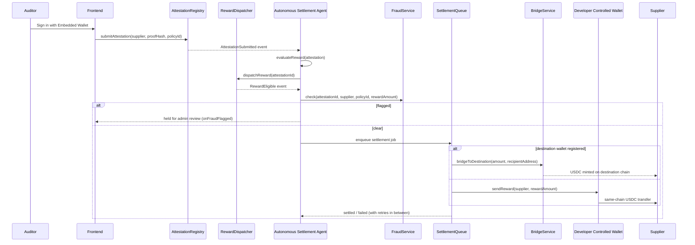

# Architecture

## Data flow

## Modules

### `contracts/AttestationRegistry.sol`

Unchanged since Milestone 1. Stores attestations in a mapping keyed by a
sequential `id`, and a second mapping to reject duplicate `proofHash` values
in O(1). The caller of `submitAttestation` is recorded as the `auditor`;
`supplier` is passed in explicitly. No payout or treasury logic — this
contract only ever appends records and emits events.

### `contracts/RewardPolicy.sol`

Owner-controlled (OpenZeppelin `Ownable`) CRUD over reward policies, keyed by
the same `policyId` an attestation references. Policies are never deleted —
`disablePolicy` just flips a flag — so historical rewards stay auditable
against the policy that was active when they were dispatched.

### `contracts/RewardDispatcher.sol`

Cross-references an attestation (read from `AttestationRegistry` via the
`IAttestationRegistry` interface) against its policy (read from
`RewardPolicy` via `IRewardPolicy`) and emits `RewardEligible` if the policy
is enabled. A `mapping(attestationId => bool)` prevents dispatching the same
attestation twice. Permissionless by design: eligibility is fully determined
by on-chain state, so there's no reason to restrict who can call it — in
practice, that's always the agent's operator wallet.

### `packages/protocol`

The only place the contracts' ABIs and shapes are defined outside Solidity.
`agent`, `apps/backend`, and `apps/frontend` all depend on it, so a contract
change is a one-file update, not a hunt across three apps. It also exports:

- `hardhatLocal` / `arcTestnet` — reusable viem `Chain` definitions, selected
  by `CHAIN_ID` rather than hardcoded per app.
- `encodeCredentialType` / `decodeCredentialType` — pack a short label (e.g.
  `"ISO-9001-AUDIT"`) into the `bytes32` `RewardPolicy.credentialType` field
  and back, so the Admin Dashboard can work with readable strings.
- `Payment` — the settlement record shape shared between the backend's
  `/api/payments` endpoint and the frontend's Supplier/Admin dashboards. Now
  carries optional `bridged` / `destinationChain` / `destinationTxHash`
  fields for cross-chain settlements.
- `DestinationWallet`, `FraudAlert`, `SettlementJobRecord`, `AgentHealth` —
  the read models behind `/api/destination-wallet`, `/api/fraud-alerts`,
  `/api/settlement-queue`, and `/api/agent-health`.
- `SUPPORTED_DESTINATION_CHAINS` (`destinationChains.ts`) — the single list
  of chains this deployment can bridge to, shared by the agent's
  `validateDestinationWallet()`, the backend's registration endpoint, and
  the frontend's destination-wallet form.

### `agent`

Single-responsibility modules composed in `index.ts`:

- `watcher.ts` — pure I/O: opens a viem `watchContractEvent` subscription on
  `AttestationRegistry` and forwards decoded logs.
- `rewardEngine.ts` — pure function, no I/O. `evaluateReward(attestation) ->
{ eligible, reason }`, an off-chain pre-check before spending gas calling
  `dispatchReward` — the contract is still the authoritative check.
- `dispatcher.ts` — calls `RewardDispatcher.dispatchReward` on-chain (via
  `simulateContract` first, so `AlreadyDispatched` / `PolicyNotEnabled` are
  reported as typed results instead of thrown errors), and separately
  watches `RewardEligible`.
- `services/treasuryService.ts` — the `TreasuryService` interface plus its
  two implementations (Circle DCW, local signer). See
  [`decisions.md`](decisions.md) for why native-currency transfer is the
  right primitive here.
- `services/fraudService.ts` — rule-based `FraudService.check()`, pure
  scoring logic over in-memory rolling history (see
  [`decisions.md`](decisions.md) for why it's a separate signal from the
  backend's evidence-content Gemini analysis, not a replacement for it).
  Unit-tested in `fraudService.test.ts`.
- `services/settlementQueue.ts` — `SettlementQueue`, a single-worker
  in-memory job queue with exponential-backoff retries and a structured
  `onStateChange` hook. Unit-tested in `settlementQueue.test.ts`.
- `services/bridgeService.ts` — `BridgeService.bridgeToDestination()`, wraps
  `@circle-fin/app-kit`'s `bridge()` for cross-chain CCTP settlement, using
  whichever adapter (`@circle-fin/adapter-circle-wallets` or
  `@circle-fin/adapter-viem-v2`) matches the active `TreasuryConfig.mode` so
  the bridge always signs from the same address the treasury balance
  reflects.
- `wallet/destinationWallet.ts` — `validateDestinationWallet()`, pure
  validation for a supplier's requested destination chain/address.
  `SUPPORTED_DESTINATION_CHAINS` itself lives in `packages/protocol` (see
  below) so the agent, backend, and frontend can't disagree about what's
  supported.
- `logger.ts` / `config.ts` — unchanged in spirit from Milestone 1: scoped
  leveled logging, and zod-validated configuration (now including the
  treasury's discriminated `circle | local` config and an optional
  `fraudScoreThreshold`) that fails fast with a clear message.

`index.ts`'s `runAgent()` wires these together and returns an `AgentControl`
(`{ stop, approvePayout }`) rather than a bare stop function — `approvePayout`
lets a host process (the backend, once an admin approves a held fraud alert)
manually re-enqueue a settlement through the exact same path `RewardEligible`
would have used automatically, just skipping the fraud check itself. It also
accepts optional hooks (`onAttestation`, `onRewardEligible`,
`onPaymentSettled`, `onFraudFlagged`, `onQueueStateChange`,
`getDestinationWallet`) so a host process can track state (e.g. for HTTP
dashboards) and supply destination-wallet lookups without the agent knowing
anything about persistence or transport — the same separation that let
Milestone 1's `logger.ts` be swapped without touching `watcher.ts`.

### `apps/backend`

An Express API that also runs the agent process:

- `main.ts` — loads `.env`, builds the `Store`, `TreasuryService`,
  `PolicyService`, and (if Circle credentials are set) `WalletService`,
  starts the agent via `runAgent()`, and starts the HTTP server. Also wires
  `runAgent`'s new hooks: `onFraudFlagged` creates a `Store` fraud-alert
  record, `onQueueStateChange` mirrors settlement-job state, and
  `getDestinationWallet` answers the agent's cross-chain routing question
  from the `Store`'s registered destination wallets.
- `store.ts` — in-memory read models for attestations, payments,
  destination wallets, fraud alerts, settlement-job state, and an
  agent-health snapshot, populated by the agent's hooks. A deliberate
  demo-scale stand-in for a database: swapping it for one only touches this
  file.
- `services/policyService.ts` — reads `RewardPolicy` for the Admin
  Dashboard. Since the contract only exposes `getPolicy(id)` (per spec),
  this replays `PolicyCreated` events to discover known ids, then re-reads
  each one's current state.
- `services/walletService.ts` — brokers Circle User-Controlled Wallets: user
  sessions, wallet-creation challenges (now `accountType: 'SCA'` for Gas
  Station eligibility), and contract-execution challenges (for attestation
  submission), all requiring the API key this server holds and the frontend
  never sees.
- `server.ts` — the Express app: dashboard read routes,
  `/api/wallet-sessions/*` for the embedded-wallet flow, and the new
  `/api/destination-wallet`, `/api/fraud-alerts` (+ `/approve`/`/reject`),
  `/api/settlement-queue`, and `/api/agent-health` routes. Approving a fraud
  alert calls `agentControl.approvePayout()` — the same manual-settlement
  path described in the `agent` section above.

### `apps/frontend`

Vite + React 19, styled-components for CSS-in-JS (no Tailwind, per spec),
routed with `react-router-dom` into three dashboards (`AuditorDashboard`,
`SupplierDashboard`, `AdminDashboard`).

- `lib/clients.ts` — Milestone 1's injected-wallet flow
  (`connectWallet()` / `getPublicClient()`), still used by the **Admin**
  dashboard for owner-controlled policy management, where an injected
  wallet (the contracts' `owner`) is the right model.
- `lib/embeddedWallet.ts` / `hooks/useEmbeddedWallet.ts` — the embedded-wallet
  flow used by **Auditor** and **Supplier**: wraps Circle's `W3SSdk`,
  resumes an existing wallet by email or runs the PIN-setup +
  wallet-creation challenge for a first login, and exposes a
  `submitAttestation()` that also goes through a Circle challenge (so the
  attestation transaction is signed by the embedded wallet, not by this
  server).
- `lib/api.ts` — the one place that talks to `apps/backend`'s HTTP API,
  including the new destination-wallet, fraud-alert, settlement-queue, and
  agent-health calls.
- `lib/streams.ts` — merges the backend's independent read models into one
  "stream" per attestation. The `supplier-paid` node now reports bridge
  status (destination chain + tx hash) when a payout settled cross-chain,
  same honest-data discipline as the AI Risk Analysis node: real state only,
  `unavailable`/default detail otherwise, never invented.

Both wallet flows are deliberately isolated behind their own module so a
later swap (Arc App Kit for the embedded side) touches one file, not the
dashboards built on top of them. Cross-chain settlement itself is
`agent/src/services/bridgeService.ts`, on the backend side — the frontend
only ever reads its result off `Payment`.
